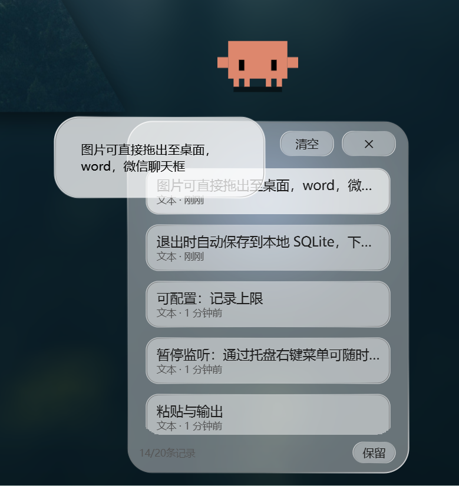
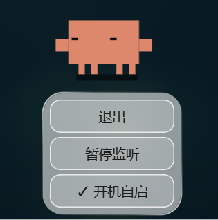

# Clipboard Manager

A Windows system-tray clipboard history manager built with PySide6.

## 这个剪切板有哪些优势？

Windows 自带的剪贴板（Win+V）有两个small缺陷：

1. **无法预览内容** — 图片和长文本缩在小小的条目里，根本看不清
2. **无法拖拽复用** — 只能点一下粘贴到当前窗口，无法把图片拖到桌面保存，也无法拖到微信/Word 等应用中

Clipboard Manager 解决了这两个问题。

### 右键预览

鼠标右键按住条目即可放大预览，图片可查看细节，长文本可逐行阅读，松开即关。



### 拖拽到任意应用

直接把图片拖到桌面保存为文件，拖到微信/QQ 聊天窗口发送，拖到 Word/PPT 嵌入文档。也可以拖出文字、HTML、文件列表。



## Features

♥- 监控系统剪贴板，支持文本、HTML、图片、文件列表、颜色值
♥- **右键长按任意条目即可放大预览**（图片 / 长文本均支持）
♥- **拖拽条目到桌面 / 微信 / Word 等任意应用**
♥- 玻璃拟态弹窗 UI，鼠标跟随光晕动画(两个光晕)
♥- 开机自启(支持自定义开关开机自启)
♥- 支持开启关闭监听(防止复制到敏感信息)
♥- 支持保存20/50条记录，超过后自动清除
♥- 固定到任务栏后，使用非常方便
## Requirements

- Windows 10+
- Python 3.10+
- PySide6 >= 6.5.0

## Quick Start

```bash
pip install -r requirements.txt
python -m clipboard_manager.main
```

## Download

从 [Releases](https://github.com/Leon-aHao/clipboard-manager-demo/releases) 页面下载 `ClipboardManager.exe`，双击运行，无需安装 Python。

## Build

```bash
pyinstaller clipboard_manager.spec
```

## Project Structure

```
clipboard_manager/
├── main.py                 # Entry point
├── controllers/            # App controller (wires signals/slots)
├── core/                   # Clipboard monitor, format detection, hashing
├── models/                 # Data models + SQLite database
├── views/                  # PySide6 UI (popup, tray, history list)
└── utils/                  # Win32 API, themes, temp files
```
